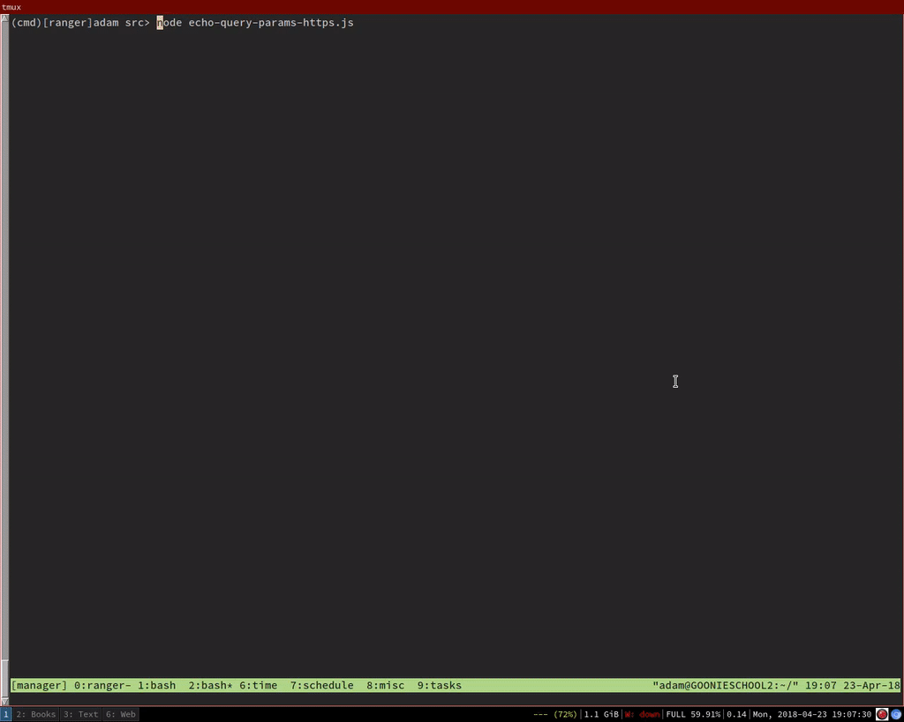
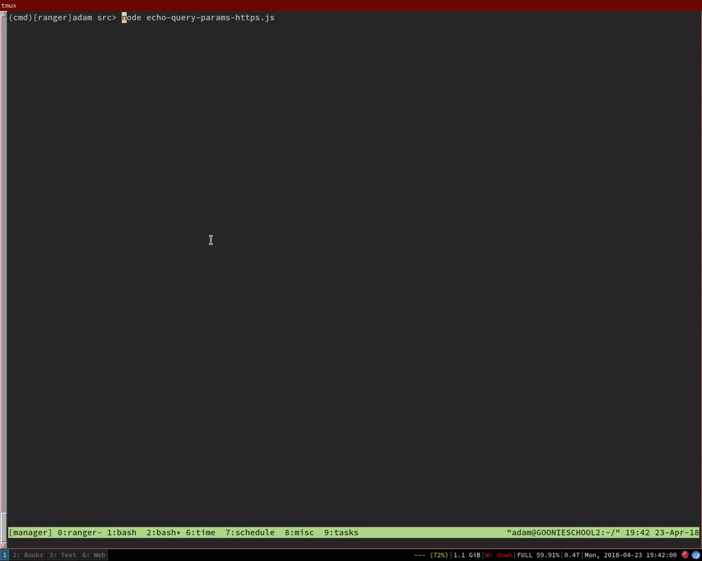

# Project 8 - Pentesting Live Targets

Time spent: **27** hours spent in total

> Objective: Identify vulnerabilities in three different versions of the Globitek website: blue, green, and red.

The six possible exploits are:
* Username Enumeration
* Insecure Direct Object Reference (IDOR)
* SQL Injection (SQLi)
* Cross-Site Scripting (XSS)
* Cross-Site Request Forgery (CSRF)
* Session Hijacking/Fixation

Each version of the site has been given two of the six vulnerabilities. (In other words, all six of the exploits should be assignable to one of the sites.)

## Blue

Vulnerability #1: SQL Injection

Vulnerability #2: Session Hijacking/Fixation

## Green

Vulnerability #1: Username Enumeration

Vulnerability #2: XSS

## Red

Vulnerability #1: IDOR

Vulnerability #2: CSRF

## Notes

My difficulties:

### Working Slow

The work went pretty slowly. There was a lot of ground to cover, and I
wasn't sure how to cover it quickly. Especially for SQL injection and
XSS, and somewhat for IDOR. This requires a lot of manual testing to
do, and I don't have any automation tools yet. I've tried building
some of my own, with mixed success.

### Not Sure What to Look For

For IDOR, I wasn't 100% sure what to look for. You were permitted to
visit most of the salesmen's pages, so what did it mean for there to
be an IDOR involving them? What insecurity was there? I was confused
about that for a while. It was only after I went to the red site that
I saw that there were other salesmen that whose records you shouldn't
be able to see, but that you were capable of viewing on the red
website.

### Not Sure What's Wrong

With XSS and SQLi, I'm not sure how to tell what I'm doing wrong so
that I can move on to something better. How should I know if:

- The input that I'm testing is not vulnerable to what I'm trying?
  Perhaps it's protected against injections in general. Perhaps it's
  just filtering out my `<script>` tag. How can you tell? Perhaps if I
  had some tool that systematically tested something with a bunch of
  tests such that, if the input is vulnerable, then one of the test
  inputs should've worked, then I can KNOW which part is wrong.
  Similarly for SQLi, maybe the particular query you tried is
  protected against. Maybe they're all protected against. When I
  couldn't find the SQLi vulnerability, I thought that I didn't have
  the right injections for the inputs, rather than thinking that I had
  the wrong input.

### Not able to clear the Stored XSS attacks

Because I couldn't clear the stored XSS attacks on the feedback
display page, I couldn't just do all of the XSS attacks directly. For
instance, if I tried to redirect the user first, and that XSS was
evaluated before any other XSS, then the others would never execute.
I'd be stuck like that.

I figured my best option was to use the `src` tag with the script, and
have a URL where the contents of the script can change without
changing the URL. I don't have a server on hand to just host stuff, so
I had to figure out another option. I settled on
<https://Pastebin.com>, though it gave me some difficulties at first.
The raw links for the pastes can be used for XSS, but the content of
the raw links is sometimes slow to update. I had to visit the raw
page, and refresh it a few times before changes would take effect.

### HTTPOnly Cookies

The PHPSESSID cookies were HTTP only, which made viewing and editing
the cookies difficult, until I figured out some way to shut off
HTTPOnly (which is sorta cheating, because I didn't do this as an
attacker, I'd shut it off as the victim). 

# Exploits

## CSRF

## IDOR

## Session Fixation

## Session Hijack

## User Enumeration

## XSS

## Cookie Reading

## Cookie Writing

## XSS Session Hijack

## Advanced SQLi

I don't have a GIF for this, because it was a very long process, but I
do have a list of all the tables in the database:

- CHARACTER_SETS
- COLLATIONS
- COLLATION_CHARACTER_SET_APPLICABILITY
- COLUMNS
- COLUMN_PRIVILEGES
- ENGINES
- EVENTS
- FILES
- GLOBAL_STATUS
- GLOBAL_VARIABLES
- KEY_COLUMN_USAGE
- OPTIMIZER_TRACE
- PARAMETERS
- PARTITIONS
- PLUGINS
- PROCESSLIST
- PROFILING
- REFERENTIAL_CONSTRAINTS
- ROUTINES
- SCHEMATA
- SCHEMA_PRIVILEGES
- SESSION_STATUS
- SESSION_VARIABLES
- STATISTICS
- TABLES
- TABLESPACES
- TABLE_CONSTRAINTS
- TABLE_PRIVILEGES
- TRIGGERS
- USER_PRIVILEGES
- VIEWS
- INNODB_LOCKS
- INNODB_TRX
- INNODB_SYS_DATAFILES
- INNODB_FT_CONFIG
- INNODB_SYS_VIRTUAL
- INNODB_CMP
- INNODB_FT_BEING_DELET
- INNODB_CMP_RESET
- INNODB_CMP_PER_INDEX
- INNODB_CMPMEM_RESET
- INNODB_FT_DELETED
- INNODB_BUFFER_PAGE_LRU
- INNODB_LOCK_WAITS
- INNODB_TEMP_TABLE_INFO
- INNODB_SYS_INDEXES
- INNODB_SYS_TABLES
- INNODB_SYS_FIELDS
- INNODB_CMP_PER_INDEX_RESET
- INNODB_BUFFER_PAGE
- INNODB_FT_DEFAULT_STOPWORD
- INNODB_FT_INDEX_TABLE
- INNODB_FT_INDEX_CACHE
- INNODB_SYS_TABLESPACES
- INNODB_METRICS
- INNODB_SYS_FOREIGN_COLS
- INNODB_CMPMEM
- INNODB_BUFFER_POOL_STATS
- INNODB_SYS_COLUMNS
- INNODB_SYS_FOREIGN
- INNODB_SYS_TABLESTATS
- countries
- failed_logins
- feedback
- salespeople
- salespeople_territories
- states
- territories
- users
- columns_priv
- db
- engine_cost
- event
- func
- general_log
- gtid_executed
- help_category
- help_keyword
- help_relation
- help_topic
- innodb_index_stats
- innodb_table_stats
- ndb_binlog_index
- plugin
- proc
- procs_priv
- proxies_priv
- server_cost
- servers
- slave_master_info
- slave_relay_log_info
- slave_worker_info
- slow_log
- tables_priv
- time_zone
- time_zone_leap_second
- time_zone_name
- time_zone_transition
- time_zone_transition_type
- user
- accounts
- cond_instances
- events_stages_current
- events_stages_history
- events_stages_history_long
- events_stages_summary_by_account_by_event_name
- events_stages_summary_by_host_by_event_name
- events_stages_summary_by_thread_by_event_name
- events_stages_summary_by_user_by_event_name
- events_stages_summary_global_by_event_name
- events_statements_current
- events_statements_history
- events_statements_history_long
- events_statements_summary_by_account_by_event_name
- events_statements_summary_by_digest
- events_statements_summary_by_host_by_event_name
- events_statements_summary_by_program
- events_statements_summary_by_thread_by_event_name
- events_statements_summary_by_user_by_event_name
- events_statements_summary_global_by_event_name
- events_transactions_current
- events_transactions_history
- events_transactions_history_long
- events_transactions_summary_by_account_by_event_name
- events_transactions_summary_by_host_by_event_name
- events_transactions_summary_by_thread_by_event_name
- events_transactions_summary_by_user_by_event_name
- events_transactions_summary_global_by_event_name
- events_waits_current
- events_waits_history
- events_waits_history_long
- events_waits_summary_by_account_by_event_name
- events_waits_summary_by_host_by_event_name
- events_waits_summary_by_instance
- events_waits_summary_by_thread_by_event_name
- events_waits_summary_by_user_by_event_name
- events_waits_summary_global_by_event_name
- file_instances
- file_summary_by_event_name
- file_summary_by_instance
- host_cache
- hosts
- memory_summary_by_account_by_event_name
- memory_summary_by_host_by_event_name
- memory_summary_by_thread_by_event_name
- memory_summary_by_user_by_event_name
- memory_summary_global_by_event_name
- metadata_locks
- mutex_instances
- objects_summary_global_by_type
- performance_timers
- prepared_statements_instances
- replication_applier_configuration
- replication_applier_status
- replication_applier_status_by_coordinato
- replication_applier_status_by_worker
- replication_connection_configuration
- replication_connection_status
- replication_group_member_stats
- replication_group_members
- rwlock_instances
- session_account_connect_attrs
- session_connect_attrs
- setup_actors
- setup_consumers
- setup_instruments
- setup_objects
- setup_timers
- socket_instances
- socket_summary_by_event_name
- socket_summary_by_instance
- status_by_account
- status_by_host
- status_by_thread
- status_by_user
- table_handles
- table_io_waits_summary_by_index_usage
- table_io_waits_summary_by_table
- table_lock_waits_summary_by_table
- threads
- user_variables_by_thread
- variables_by_thread
- host_summary
- host_summary_by_file_io
- host_summary_by_file_io_type
- host_summary_by_stages
- host_summary_by_statement_latency
- host_summary_by_statement_type
- innodb_buffer_stats_by_schema
- innodb_buffer_stats_by_table
- io_by_thread_by_latency
- io_global_by_file_by_bytes
- io_global_by_file_by_latency
- io_global_by_wait_by_bytes
- io_global_by_wait_by_latency
- latest_file_io
- memory_by_host_by_current_bytes
- memory_by_thread_by_current_bytes
- memory_by_user_by_current_bytes
- memory_global_by_current_bytes
- memory_global_total
- metrics
- ps_check_lost_instrumentation
- schema_auto_increment_columns
- schema_index_statistics
- schema_object_overview
- schema_redundant_indexes
- schema_table_lock_waits
- schema_table_statistics
- schema_table_statistics_with_buffer
- schema_tables_with_full_table_scans
- schema_unused_indexes
- session
- session_ssl_status
- statement_analysis
- statements_with_errors_or_warnings
- statements_with_full_table_scans
- statements_with_runtimes_in_95th_percentile
- statements_with_sorting
- statements_with_temp_tables
- sys_config
- user_summary
- user_summary_by_file_io
- user_summary_by_file_io_type
- user_summary_by_stages
- user_summary_by_statement_latency
- user_summary_by_statement_type
- version
- wait_classes_global_by_avg_latency
- wait_classes_global_by_latency
- waits_by_host_by_latency
- waits_by_user_by_latency
- waits_global_by_latency

