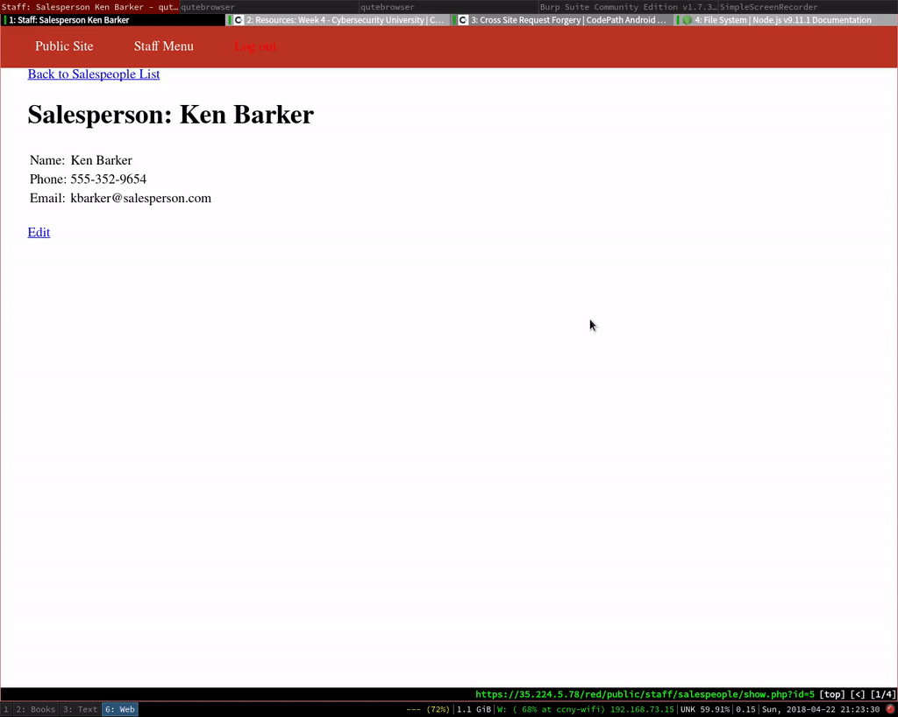
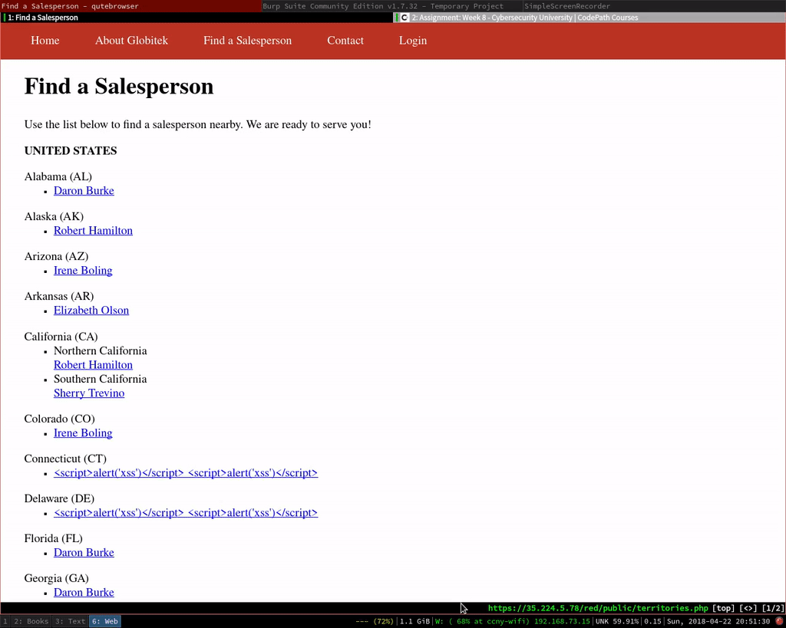
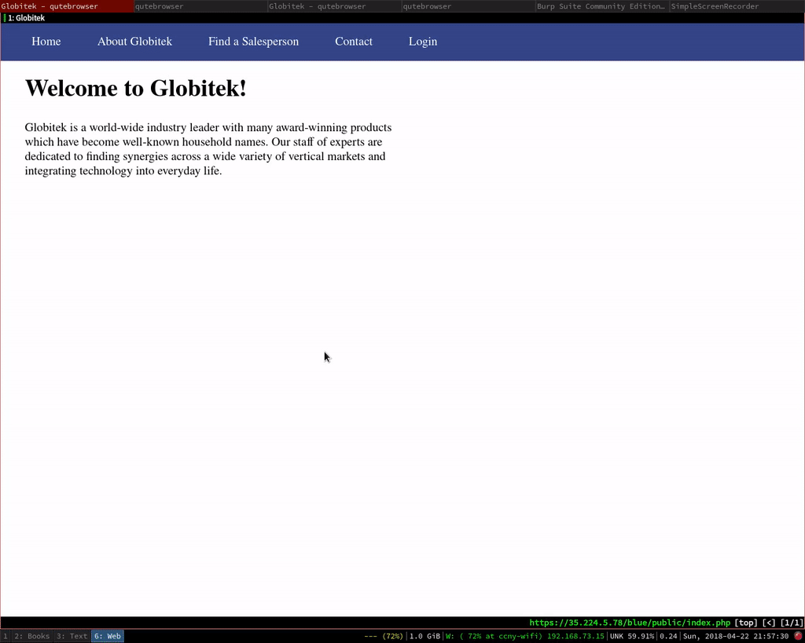
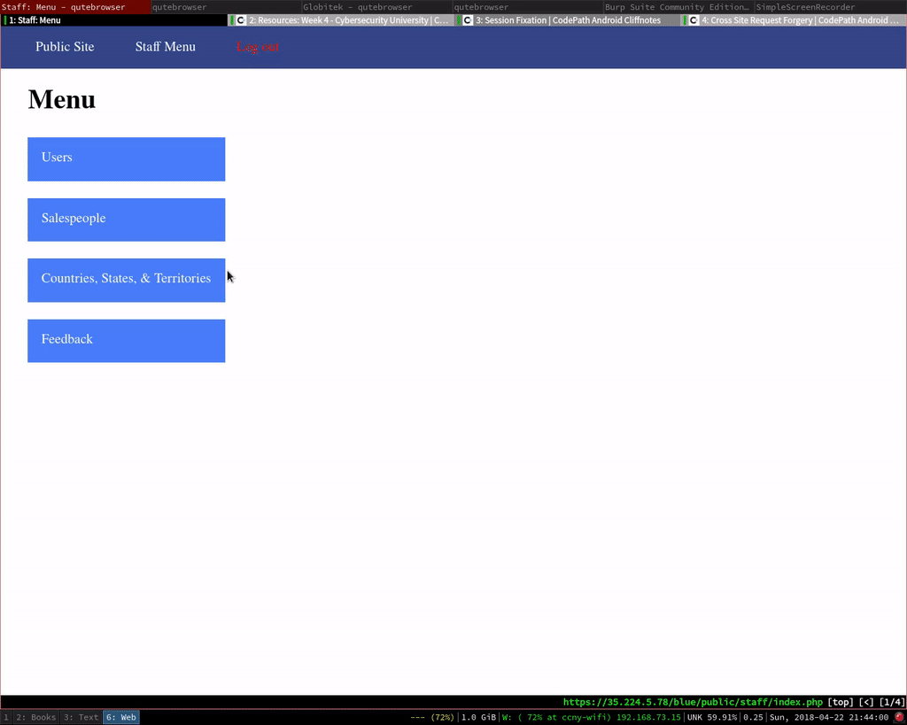
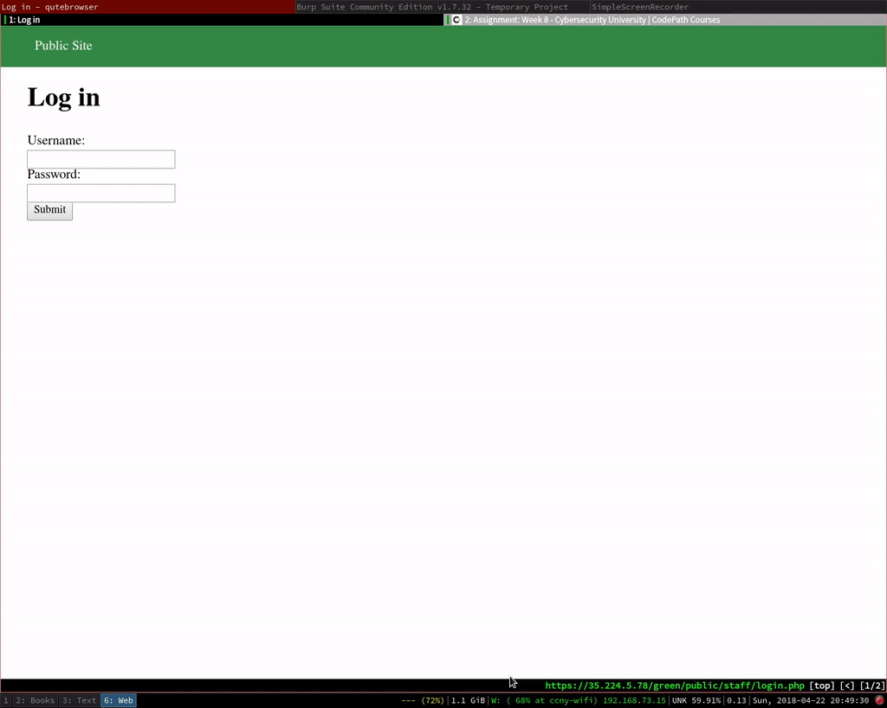
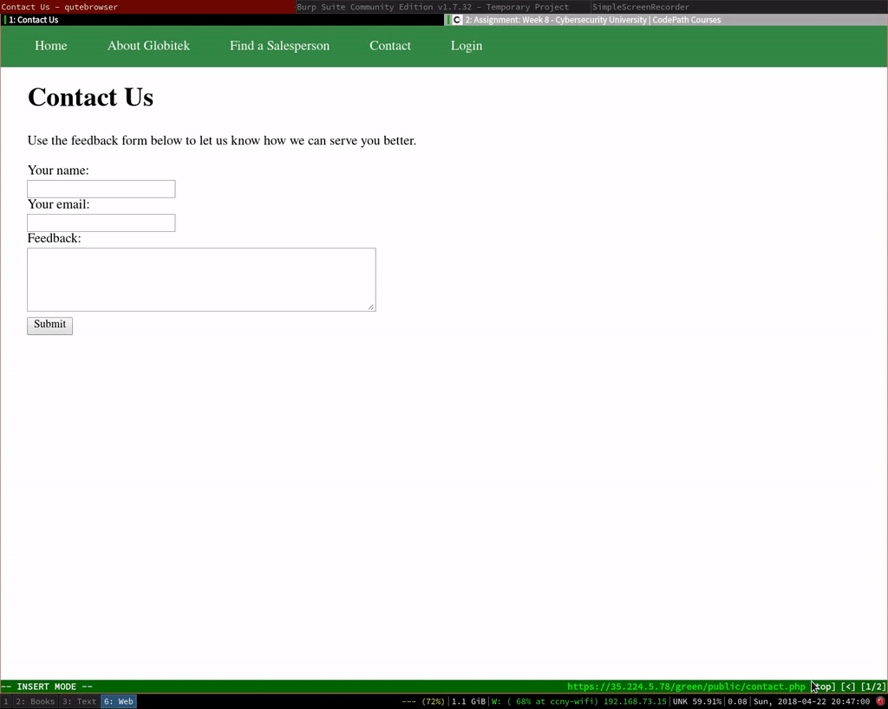

# Project 8 - Pentesting Live Targets

Time spent: **20** hours spent in total

> Objective: Identify vulnerabilities in three different versions of the Globitek website: blue, green, and red.

The six possible exploits are:
* Username Enumeration
* Insecure Direct Object Reference (IDOR)
* SQL Injection (SQLi)
* Cross-Site Scripting (XSS)
* Cross-Site Request Forgery (CSRF)
* Session Hijacking/Fixation

Each version of the site has been given two of the six vulnerabilities. (In other words, all six of the exploits should be assignable to one of the sites.)

## Blue

Vulnerability #1: SQL Injection

Vulnerability #2: Session Hijacking/Fixation

## Green

Vulnerability #1: Username Enumeration

Vulnerability #2: XSS

## Red

Vulnerability #1: IDOR

Vulnerability #2: CSRF

## Notes

The work went pretty slowly. There was a lot of ground to cover, and I
wasn't sure how to cover it quickly. Especially for SQL injection and
XSS, and somewhat for IDOR.

For SQLi, I figured I'd have to keep records of all of the forms
that could be exploited, and then systematically try inputs in order
to create an error message. I tried to write a script that would fuzz,
but that was taking quite long, too. Writing something general purpose
that would work took around as long as manually fuzzing all of the
inputs on the site.

For XSS and IDOR, I wasn't 100% sure what to look for.  With XSS, when
I didn't get results, I wasn't sure if it was because the inputs were
filtering my particular input, if they were secure against any of the
inputs I'd likely throw at them. It was hard to tell when it was time
to move on. For IDOR, you were permitted to visit most of the
salesmen's pages, so what did it mean for there to be an IDOR
involving them? What insecurity was there? I was confused about that
for a while. It was only after I went to the red site that I saw that
there were other salesmen that whose records you shouldn't be able to
see, but that you were capable of viewing on the red website.

# Exploits

## CSRF

## IDOR

## Session Fixation

## Session Hijack

## User Enumeration

## XSS

